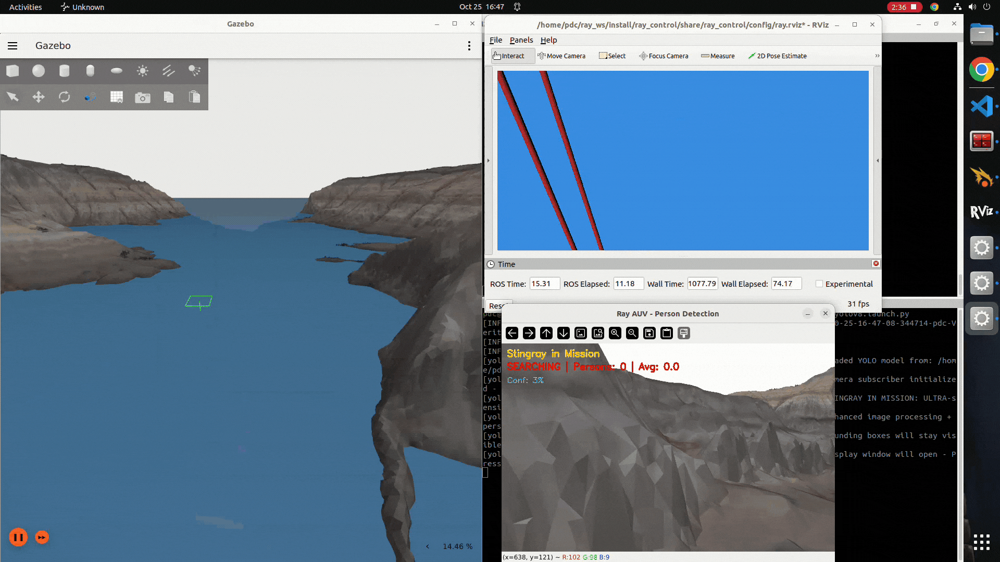
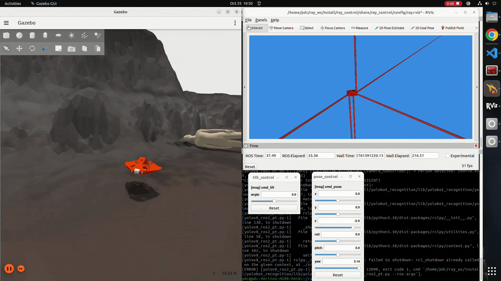
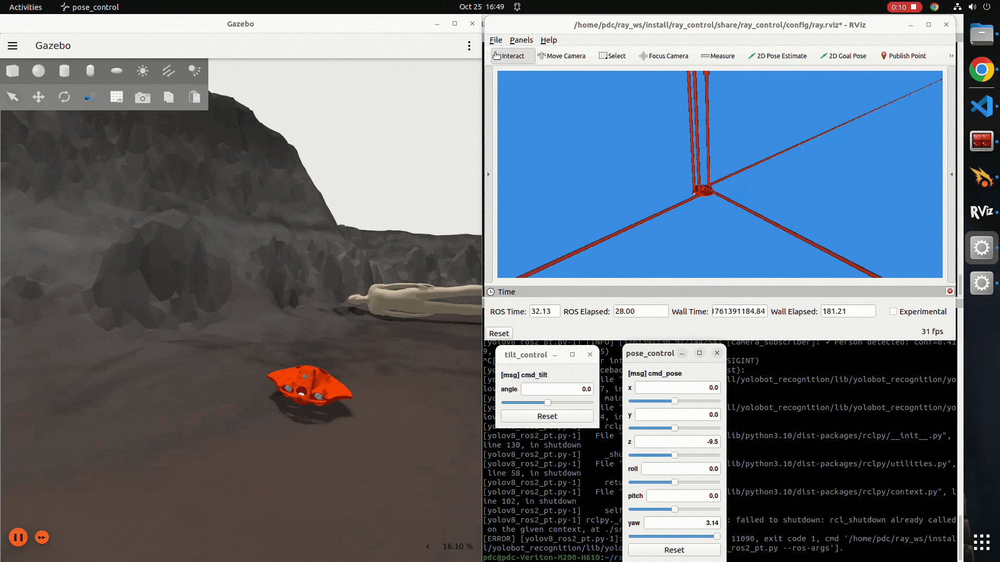

# ROS 2-Based Nonlinear Control of a Stingray-Inspired AUV for Underwater Search and Rescue

This simulation package was developed as part of my ongoing research in biomimetic underwater robotics and autonomous control systems.

---

## 🧭 Overview

- This repository contains a **ROS 2-based simulation** of a **stingray-inspired Autonomous Underwater Vehicle (AUV)** designed for **underwater search and rescue missions**.

- The AUV incorporates a **custom six-thruster configuration** that enables full **six-degree-of-freedom (6-DoF) motion control** with minimal coupling.  
A **nonlinear Sliding Mode Controller (SMC)** ensures robust trajectory tracking and disturbance rejection in underwater environments.

- The model is validated in **Ignition Gazebo Fortress** with **ROS 2 Humble**, featuring **YOLOv8-based real-time human detection** for underwater perception tasks.

---

## 🖼️ Simulation Videos

### Real-time YOLOv8-based underwater human detection 

<p align="center">
  
  <br>
</p>

### Heave motion of Stingray AUV controlled by nonlinear SMC controller

<p align="center">
  
  <br>
</p>

### Yaw motion of Stingray AUV

<p align="center">
  
  <br>
</p>

---

## ✅ Features

- Stingray-inspired hydrodynamic body design for enhanced maneuverability  
- Six-thruster configuration enabling full 6-DoF control  
- Nonlinear **Sliding Mode Control (SMC)** for robust trajectory tracking  
- **Thruster Allocation Matrix (TAM)** with optimized stability *(Condition Number: 2.35)*  
- Real-time **YOLOv8-based underwater person detection**  
- Fully integrated with **ROS 2 Humble** and **Ignition Gazebo Fortress**  
- Real-time visualization and control in **RViz2**  
- Modular and extensible **ROS 2 package structure**

---

## 🧰 Technology Stacks Used

| Component | Technology |
|------------|-------------|
| **ROS 2** | Humble Hawksbill |
| **Simulation** | Ignition Gazebo Fortress (v6.17.0) |
| **Languages** | Python, C++ |
| **Control System** | Nonlinear Sliding Mode Controller (SMC) |
| **Perception** | YOLOv8 (Ultralytics) |
| **Visualization** | RViz2, Ignition GUI |

---

## 💻 Installation and Setup

### ✅ Prerequisites

- Ubuntu 22.04  
- ROS 2 Humble  
- Ignition Gazebo Fortress (v6.17.0)  
- Python 3.10  
- Ultralytics YOLOv8  

---

### 🔧 Installation Steps

```bash
# Create workspace
mkdir -p ~/ray_ws/src
cd ~/ray_ws/src

# Clone repository
git clone https://github.com/Abinesh-Thankaraj/ray_auv.git

# Build packages
cd ~/ray_ws
colcon build --symlink-install
source install/setup.bash
