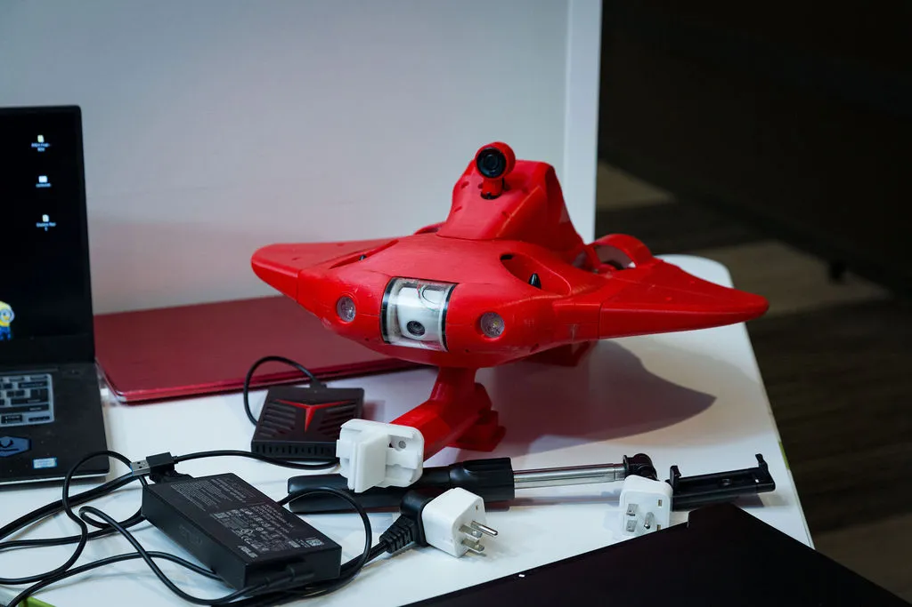

# 🤖 Underwater Remotely Operated Vehicle v2.0



A compact and efficient **Underwater Remotely Operated Vehicle (ROV)** designed for search and rescue missions in turbulent water bodies like the Ganga River. This system combines real-time video monitoring and intelligent object detection to support underwater navigation and victim identification.

---

# ROS 2-Based Nonlinear Control of a Stingray-Inspired AUV for Underwater Search and Rescue

This simulation package was developed as part of my ongoing research in biomimetic underwater robotics and autonomous control systems.

---

## 🧭 Overview

- This repository contains a **ROS 2-based simulation** of a **stingray-inspired Autonomous Underwater Vehicle (AUV)** designed for **underwater search and rescue missions**.

- The AUV incorporates a **custom six-thruster configuration** that enables full **six-degree-of-freedom (6-DoF) motion control** with minimal coupling.  
A **nonlinear Sliding Mode Controller (SMC)** ensures robust trajectory tracking and disturbance rejection in underwater environments.

- The model is validated in **Ignition Gazebo Fortress** with **ROS 2 Humble**, featuring **YOLOv8-based real-time human detection** for underwater perception tasks.

---

## 🖼️ Simulation Videos

### 1. Real-time YOLOv8-based underwater human detection 

<p align="center">
  
  <br>
</p>

### 2. Heave motion of Stingray AUV controlled by nonlinear SMC controller

<p align="center">
  
  <br>
</p>

### 3. Yaw motion of Stingray AUV

<p align="center">
  
  <br>
</p>

---

## ✅ Features

- Stingray-inspired hydrodynamic body design for enhanced maneuverability  
- Six-thruster configuration enabling full 6-DoF control  
- Nonlinear **Sliding Mode Control (SMC)** for robust trajectory tracking  
- **Thruster Allocation Matrix (TAM)** with optimized stability *(Condition Number: 2.35)*  
- Real-time **YOLOv8-based underwater person detection**  
- Fully integrated with **ROS 2 Humble** and **Ignition Gazebo Fortress**  
- Real-time visualization and control in **RViz2**  
- Modular and extensible **ROS 2 package structure**

---

## 🧰 Technology Stacks Used

| Component | Technology |
|------------|-------------|
| **ROS 2** | Humble Hawksbill |
| **Simulation** | Ignition Gazebo Fortress (v6.17.0) |
| **Languages** | Python, C++ |
| **Control System** | Nonlinear Sliding Mode Controller (SMC) |
| **Perception** | YOLOv8 (Ultralytics) |
| **Visualization** | RViz2, Ignition GUI |

---

## 💻 Installation and Setup

### ✅ Prerequisites

- Ubuntu 22.04  
- ROS 2 Humble  
- Ignition Gazebo Fortress (v6.17.0)  
- Python 3.10  
- Ultralytics YOLOv8  

---

### 🔧 Installation Steps

```bash
# Create workspace
mkdir -p ~/ray_ws/src
cd ~/ray_ws/src

# Clone repository
git clone https://github.com/Abinesh-Thankaraj/ray_auv.git

# Build packages
cd ~/ray_ws
colcon build --symlink-install
source install/setup.bash
```

---

## 🚀 Launching the Simulation

### 1. Canyon World Launch  
Spawns the Stingray AUV in an underwater Gazebo world:
```bash
ros2 launch ray_description canyon_world_launch.py
```

### 2. Launch the Nonlinear Control System (SMC)
Starts the Sliding Mode Controller (SMC) and visualizes wrenches and forces in RViz:
```bash
ros2 launch ray_control custom_sliding_mode_launch.py
```

### 3. Launch YOLOv8-Based Person Detection
Activates underwater human detection using YOLOv8:
```bash
ros2 launch yolobot_recognition launch_yolov8.launch.py
```
This launches:
- Real-time Person Detection interface
- Ignition Gazebo Fortress (v6.17.0) GUI
- RViz2 visualization

---

## 📊 Results and Visualization

 - RMS position error: < 0.1 m
 - Orientation error: < 0.05 rad
 - Significant reduction in control effort compared to traditional PID-based systems
 - Real-time perception and control demonstrated in Ignition Gazebo and RViz environments

## 📚 Future Work

 - Integration with real-time underwater camera hardware
 - Adaptive control under dynamic current profiles
 - Swarm Stingray AUV exploration and rescue planning
